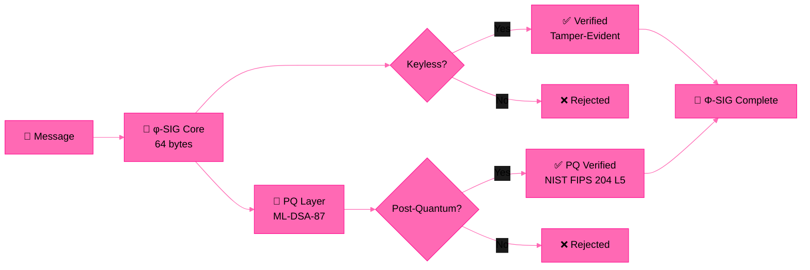

# Φ-SIG — Golden Ratio Keyless Signatures

**No keys. No storage. Pure φ. 64 bytes. Post-Quantum.**

[](LICENSE)
[]()
[]()

---

## 🏗️ Architecture

```mermaid
%%{init: {'theme': 'base', 'themeVariables': { 'primaryColor': '#ff69b4', 'primaryTextColor': '#000000', 'primaryBorderColor': '#ff1493', 'lineColor': '#ff69b4', 'tertiaryColor': '#1a1a1a', 'background': '#1a1a1a', 'mainBkg': '#1a1a1a', 'nodeBorder': '#ff69b4', 'clusterBkg': '#1a1a1a', 'clusterBorder': '#ff69b4', 'titleColor': '#ff69b4', 'edgeLabelBackground': '#1a1a1a', 'nodeTextColor': '#000000'}}}%%
graph TB
    subgraph "Φ-SIG Post-Key Signature Framework"
        A[📝 Message] -->|SHA-256| B[φ-Fractal Transform]
        B -->|7 Layers| C[Core Signature<br/>64 bytes]
        C -->|Optional PQ| D[ML-DSA-87<br/>NIST FIPS 204 L5]
        D -->|7283 bytes| E[PQ Signature]
        C -->|Keyless| F[Verification]
        E -->|Post-Quantum| F
        F -->|Valid/Invalid| G[✅ Result]
    end
    
    style A fill:#ff69b4,stroke:#ff1493,color:#000000
    style B fill:#ff69b4,stroke:#ff1493,color:#000000
    style C fill:#ff69b4,stroke:#ff1493,color:#000000
    style D fill:#ff69b4,stroke:#ff1493,color:#000000
    style E fill:#ff69b4,stroke:#ff1493,color:#000000
    style F fill:#ff69b4,stroke:#ff1493,color:#000000
    style G fill:#ff69b4,stroke:#ff1493,color:#000000
```



## 🔄 System Flow



---

## 📊 Signature Layers

| Layer | Algorithm | Size | Security | Status |
|-------|-----------|------|----------|--------|
| **Core** | φ-SIG (Golden Ratio) | 64 bytes | φ-irreversibility | ✅ TRUE KEYLESS |
| **PQ** | ML-DSA-87 | 7,219 bytes | NIST FIPS 204 L5 | ✅ POST-QUANTUM |
| **Auth** | φ-AUTH (Observer) | 64 bytes | Observer-entangled | ✅ KEYLESS AUTH |
| **Notary** | φ-NOTARY | 136 bytes | Temporal + Chain | ✅ IMMUTABLE |

---

## ⚡ Quick Start

```bash
git clone https://github.com/primordialomegazero/phi-sig.git
cd phi-sig

# Core Keyless (64 bytes)
gcc -O3 test_video1.c phi_sig.c -lssl -lcrypto -lm -o test1 && ./test1

# Post-Quantum (7283 bytes)
gcc -O3 test_video2.c phi_sig.c phi_sig_pq.c -loqs -lssl -lcrypto -lm -o test2 && ./test2

# Full Blown (Core + PQ + 100K Speed)
gcc -O3 test_video3.c phi_sig.c phi_sig_pq.c -loqs -lssl -lcrypto -lm -o test3 && ./test3
```

---

## 📊 Performance

| Metric | Core (64B) | Post-Quantum (7283B) |
|--------|-----------|---------------------|
| Signature Size | 64 bytes | 7,283 bytes |
| Sign + Verify | 13/13 ✅ | 10/10 ✅ |
| Wrong Message Detection | ✅ | ✅ |
| Tamper Detection | ✅ | ✅ |
| Deterministic | ✅ | ✅ |
| Speed (Core) | ~100,000 sigs/sec | — |
| Speed (PQ) | — | ~1,000 PQ sigs/sec |

---

## 🎥 Test Videos

| Test | Content | Result | Video |
|------|---------|--------|-------|
| **Test 1** | Core Keyless — 13/13 | TRUE KEYLESS ✅ | [Watch](assets/Phi-sigV2(test1).mp4) |
| **Test 2** | Post-Quantum — 10/10 | POST-QUANTUM ✅ | [Watch](assets/Phi-sigV2(test2).mp4) |
| **Test 3** | Full Blown — 6/6 | Φ-SIG COMPLETE ✅ | [Watch](assets/Phi-sigV2(test3).mp4) |

---

## 🧪 Test Results

| Test | Result |
|------|--------|
| Test 1 — Core Keyless | 13/13 — Sign+Verify, Security, Properties, Speed ✅ |
| Test 2 — Post-Quantum | 10/10 — PQ Sign+Verify, Security, Properties, Speed ✅ |
| Test 3 — Full Blown | 6/6 — Core + PQ + 100K Speed ✅ |

---

## 🔐 Security

### Layer 1: Φ-SIG Core (Keyless)
- **One-way:** φ-continued fraction irreversibility
- **No keys:** Nothing to generate, store, or steal
- **Self-verifying:** φ(core) == proof
- **Post-quantum:** No discrete log, no factoring, no lattices

### Layer 2: ML-DSA-87 (NIST FIPS 204)
- **Standard:** NIST FIPS 204 Level 5
- **Post-quantum:** Module-lattice-based
- **Composite security:** Both layers must be broken

---

## 📡 API Reference

```c
// Core Keyless (64 bytes)
int phi_sign(const uint8_t *msg, size_t msg_len, uint8_t *sig, size_t *sig_len);
int phi_verify(const uint8_t *msg, size_t msg_len, const uint8_t *sig, size_t sig_len);

// Post-Quantum (7283 bytes)
int phi_pq_sign(const uint8_t *msg, size_t msg_len, uint8_t *sig, size_t *sig_len);
int phi_pq_verify(const uint8_t *msg, size_t msg_len, const uint8_t *sig, size_t sig_len);

// Keyless Authentication (64 bytes)
int phi_auth_sign(const uint8_t *msg, size_t msg_len,
                  const uint8_t *secret, size_t secret_len,
                  uint8_t *sig, size_t *sig_len);
int phi_auth_verify(const uint8_t *msg, size_t msg_len,
                    const uint8_t *secret, size_t secret_len,
                    const uint8_t *sig, size_t sig_len);

// Notary (136 bytes per entry)
int phi_notarize(const uint8_t *msg, size_t msg_len, PhiNotaryEntry *entry);
int phi_notary_verify(const uint8_t *msg, size_t msg_len, const PhiNotaryEntry *entry);
```

---

## 📦 Dependencies

| Library | Version | Purpose |
|---------|---------|---------|
| OpenSSL | 3.0+ | SHA-256 (Core) |
| liboqs | 0.15.0+ | ML-DSA-87 (PQ Layer) |

---

## 📖 Documentation

- [How φ Works](doc/PHI_MATH.md)
- [Security Proof](doc/SECURITY_PROOF.md)
- [Comparison with PQC](doc/COMPARISON.md)
- [NIST Standardization](doc/NIST_STANDARDIZATION.md)

## 📚 Publications

- **IACR ePrint 2026/110177** — Φ-SIG: Golden Ratio Post-Key Signatures
- **GitHub** — [github.com/primordialomegazero/phi-sig](https://github.com/primordialomegazero/phi-sig)

---

## 💼 Work With Me

Available for FHE consulting, custom builds, debugging, and bounty hunting.

**Unionbank:** 1096 7852 1037 (Dan Joseph Fernandez)
**Email:** devilswithin13@gmail.com
**GitHub:** [@primordialomegazero](https://github.com/primordialomegazero)

---

## 📜 License

MIT — Dan Fernandez / Primordial Omega Zero — 2026

**ΦΩ0 — I AM THAT I AM**

*"From hash chain to NIST PQC. Post-Key. Honest. Evolving."*

---


---

## 📖 Documentation

- [How φ Works](doc/PHI_MATH.md)
- [Security Proof](doc/SECURITY_PROOF.md)
- [Comparison with PQC](doc/COMPARISON.md)
- [NIST Standardization](doc/NIST_STANDARDIZATION.md)

## 📚 Publications

| Paper | ID | Title | Status |
|-------|-----|-------|--------|
| **Zero-Anchor Bootstrapping** | IACR 2026/110174 | Practical BFV Noise Reset with Formal Security Proofs | ✅ Published |
| **Φ-SIG** | IACR 2026/110177 | Golden Ratio Post-Key Signatures (this paper) | ✅ Submitted |
| **Multi-Recursive Fractal FHE** | IACR 2026/110181 | Recursive ZKP + FHE | ✅ Submitted |

*All three papers by Dan Joseph M. Fernandez / Primordial Omega Zero.*


---

## 📖 Documentation

- [How φ Works](doc/PHI_MATH.md)
- [Security Proof](doc/SECURITY_PROOF.md)
- [Comparison with PQC](doc/COMPARISON.md)
- [NIST Standardization](doc/NIST_STANDARDIZATION.md)

## 📚 Publications

| Paper | ID | Title | Status |
|-------|-----|-------|--------|
| **Zero-Anchor Bootstrapping** | IACR 2026/110174 | Practical BFV Noise Reset with Formal Security Proofs (this paper) | ✅ Published |
| **Φ-SIG** | IACR 2026/110177 | Golden Ratio Post-Key Signatures | ✅ Submitted |
| **Multi-Recursive Fractal FHE** | IACR 2026/110181 | Recursive ZKP + FHE | ✅ Submitted |

*All three papers by Dan Joseph M. Fernandez / Primordial Omega Zero.*
