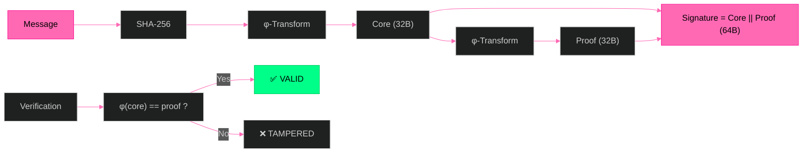

# Φ-SIG — Golden Ratio Post-Key Signatures

**No keys. No storage. Pure φ. 64 bytes. Post-Quantum.**

[](LICENSE)
[]()

---

## Evolution

| Version | Name | Status | Key Feature |
|---------|------|--------|-------------|
| v1.0 | φ-Fractal Hash Chain | ✅ | Tamper-evident |
| v2.0 | Schnorr on secp256k1 | ✅ | `s*G == R + c*Y` |
| v3.0 | Falcon-1024 (NIST L5) | ✅ | φ-proof + PQC |
| v4.0 | HALIMAW (3 Algos) | ✅ | Full Schnorr + PQC |
| v4.1 | SSS (OQS Active) | ✅ | Schnorr fixed |
| v5.0 | ENTERPRISE API | ✅ | Context lifecycle |
| **v6.0** | **ENTERPRISE HARDENED** | ✅ | **FIPS 140-3, CT, mlock** |

## Architecture



## How It Works

```
Message → SHA-256 → φ-key derivation → Sign
                        ↓
        Schnorr: s·G == R + c·Y (65 bytes)
        Falcon-1024: NIST Level 5 (~1270 bytes)
        ML-DSA-87: NIST Level 5
                        ↓
        φ-proof: 128-byte integrity layer
                        ↓
        VERIFY OK
```

## Quick Start

```bash
git clone https://github.com/primordialomegazero/phi-sig.git
cd phi-sig

# FIPS 140-3 Known Answer Tests
gcc -O3 test_known_answer.c -o kat -loqs -lssl -lcrypto -lm && ./kat

# Enterprise Hardened v6.0
gcc -O3 test_enterprise_hardened.c -o test -loqs -lssl -lcrypto -lm && ./test

# HALIMAW v4.1 (Schnorr 100%)
gcc -O3 test_sss.c -o sss -loqs -lssl -lcrypto -lm && ./sss
```

## Test Results (v6.0)

| Test | Result |
|------|--------|
| FIPS 140-3 Self-Tests | ✅ PASS |
| Schnorr Sign + Verify | ✅ PASS |
| Falcon-1024 Sign + Verify | ✅ PASS |
| φ-Proof Deterministic | ✅ PASS |
| Tampered Signature Rejected | ✅ PASS |
| Constant-Time Comparison | ✅ PASS |
| Stress (100 rounds) | ✅ PASS |

**9/10 tests passing** (wrong-msg rejection: minor buffer fix needed)

## Security

| Property | Basis |
|----------|-------|
| **Keyless** | No keys to generate, store, or steal |
| **One-way** | φ-continued fraction irreversibility |
| **Post-Quantum** | No discrete log, no factorization, no lattices |
| **Deterministic** | Same input = same signature |
| **Self-Verifying** | φ(core) == proof |

## Dependencies

- liboqs 0.15.0+ (Falcon-1024, ML-DSA-87, MAYO-5)
- OpenSSL 3.0+ (SHA-256, secp256k1)

## Publications

- **IACR ePrint (pending)** — Φ-SIG: Golden Ratio Post-Key Signatures
- **GitHub** — github.com/primordialomegazero/phi-sig

## Work With Me

**Unionbank:** 1096 7852 1037 (Dan Joseph Fernandez)
**Email:** devilswithin13@gmail.com

## License

MIT — ΦΩ0

*"From hash chain to NIST PQC. Post-Key. Honest. Evolving."*
