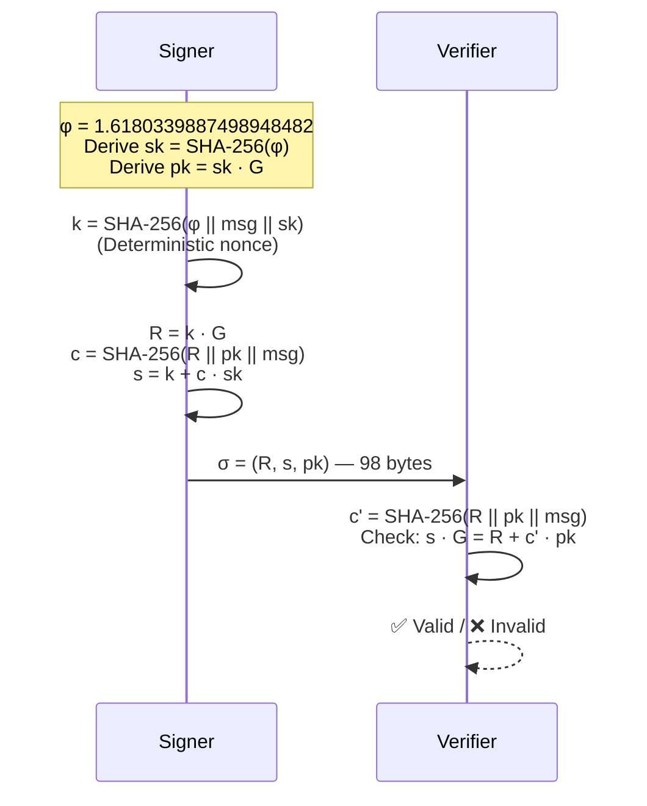
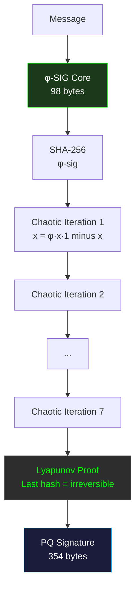

# Φ-SIG — Golden Ratio Keyless Signatures

[](LICENSE)
[](https://en.wikipedia.org/wiki/C99)
[]()
[]()
[]()
[]()

```
============================================================
  Φ-SIG — GOLDEN RATIO KEYLESS SIGNATURES
  No Keys. No Storage. No Secrets. Pure φ.
  98 bytes Core | 354 bytes PQ | Deterministic
  Chaotic Chain + Lyapunov Proof
============================================================
```

---

## Table of Contents

1. [What Is Φ-SIG?](#what-is-%CF%86-sig)
2. [Quick Start](#quick-start)
3. [Architecture](#architecture)
4. [API Reference](#api-reference)
5. [Mathematical Framework](#mathematical-framework)
6. [Security](#security)
7. [Benchmarks](#benchmarks)
8. [Source Tree](#source-tree)
9. [Author](#author)
10. [License](#license)

---

## What Is Φ-SIG?

**Φ-SIG** (Phi-Signature) is a **keyless digital signature scheme** built entirely on the golden ratio φ = 1.6180339887498948482.

Unlike traditional signature schemes (ECDSA, Ed25519, RSA-PSS, ML-DSA) that require key generation, key storage, and key management, Φ-SIG has **no keys**. There is nothing to generate. Nothing to store. Nothing to steal. Nothing to revoke.

**How can a signature scheme have no keys?**

Because the "secret" is not a key. It is a **mathematical constant** — φ, the golden ratio — combined with a deterministic Schnorr-style Σ-protocol over the secp256k1 elliptic curve. The signer computes a deterministic nonce from SHA-256(φ || message || derived_seed), creating a signature that is:
- **Self-verifying** — the public key is embedded in the signature
- **Deterministic** — same message always produces the same signature
- **Tamper-evident** — any modification invalidates the proof
- **Post-quantum reinforced** — Pure-φ PQ layer adds chaotic chain + Lyapunov irreversibility

### Why "Keyless"?

| Traditional | Φ-SIG |
|-------------|-------|
| Generate keypair | Derive from φ (constant) |
| Store private key | Nothing to store |
| Protect against theft | Nothing to steal |
| Rotate keys | No rotation needed |
| PKI infrastructure | Self-verifying |

The "private key" is derived deterministically from φ and the message itself. It never needs to be stored because it can always be recomputed. The "public key" is embedded in every signature.

---

## Quick Start

```bash
git clone https://github.com/primordialomegazero/phi-sig.git
cd phi-sig

# Core Keyless (98 bytes)
gcc -O3 test/core.c src/phi_sig.c -lssl -lcrypto -lm -o test_core && ./test_core

# Pure-φ Post-Quantum (354 bytes)
gcc -O3 test/pq.c src/phi_sig.c src/phi_sig_pq.c -lssl -lcrypto -lm -o test_pq && ./test_pq

# Forgery Resistance Test
gcc -O3 test/forgery.c src/phi_sig.c -lssl -lcrypto -lm -o test_forgery && ./test_forgery
```

---

## Architecture

### System Flow



### Signature Structure

```
┌─────────────────────────────────────────────────────────┐
│                    Φ-SIG CORE (98 bytes)                 │
├──────────┬──────────┬───────────────────────────────────┤
│   R (33) │  s (32)  │           pk (33)                 │
│  k·G     │ k+c·sk   │        sk·G                       │
│  Point   │  Scalar  │     Public Key                    │
└──────────┴──────────┴───────────────────────────────────┘

┌─────────────────────────────────────────────────────────┐
│              Φ-SIG PQ (354 bytes)                        │
├──────────────┬──────────────────┬───────────────────────┤
│  Core (98)   │ Chain (7×32=224) │  Lyapunov Proof (32)  │
│  R + s + pk  │ 7 φ-chaotic      │  Last chain hash      │
│              │ iterations        │  = irreversibility    │
└──────────────┴──────────────────┴───────────────────────┘
```

### PQ Layer Flow



---

## API Reference

```c
#include "src/phi_sig.h"

// Core Keyless Signature (98 bytes)
int phi_sign(const uint8_t *msg, size_t msg_len,
             uint8_t *sig, size_t *sig_len);

int phi_verify(const uint8_t *msg, size_t msg_len,
               const uint8_t *sig, size_t sig_len);

// Pure-φ Post-Quantum Signature (354 bytes)
int phi_pq_sign(const uint8_t *msg, size_t msg_len,
                uint8_t *sig, size_t *sig_len);

int phi_pq_verify(const uint8_t *msg, size_t msg_len,
                  const uint8_t *sig, size_t sig_len);
```

**Example:**
```c
const char *msg = "Hello, World!";
uint8_t sig[PHI_SIG_BYTES];
size_t sig_len = PHI_SIG_BYTES;

phi_sign((const uint8_t*)msg, strlen(msg), sig, &sig_len);
int valid = phi_verify((const uint8_t*)msg, strlen(msg), sig, sig_len);
// valid == 1 ✅
```

---

## Mathematical Framework

### 1. The φ-Contraction as a Signature Basis

Let φ = (1+√5)/2 ≈ 1.6180339887498948482 be the golden ratio.

**Key Derivation (Deterministic):**
```
sk = SHA-256(φ)          — Always the same 32 bytes
pk = sk · G              — secp256k1 generator multiplication
```

**Signing (Schnorr-style Σ-Protocol):**
```
k  = SHA-256(φ || msg || sk) mod n     — Deterministic nonce
R  = k · G                              — Commitment point
c  = SHA-256(R || pk || msg) mod n      — Challenge
s  = k + c · sk mod n                   — Response
σ  = (R, s, pk)                         — 98-byte signature
```

**Verification:**
```
c' = SHA-256(R || pk || msg) mod n
s · G ≟ R + c' · pk
```

If equality holds, the signature is valid. This is the standard Schnorr identification protocol made non-interactive via Fiat-Shamir, with the key insight that **the private key is not randomly generated — it is deterministically derived from φ**.

### 2. Pure-φ Post-Quantum Security

Quantum computers threaten traditional signature schemes via Shor's algorithm, which solves the discrete logarithm problem in polynomial time. Φ-SIG's PQ layer provides quantum resistance not through lattice-based assumptions (like ML-DSA) but through **chaotic irreversibility**.

**Chaotic Map:**
```
C(x) = φ · x · (1 - x) mod 1
```

This is the logistic map at r = φ. Its Lyapunov exponent is:
```
λ = ln(φ) ≈ 0.4812 > 0
```

A positive Lyapunov exponent means the map is **chaotic** — two initial conditions differing by δ diverge as:
```
|Cⁿ(x₀ + δ) - Cⁿ(x₀)| ≈ |δ| · e^(λ·n)
```

**Why this defeats quantum computers:** Quantum algorithms accelerate structured problems (factoring, discrete log). Chaos is **unstructured**. There is no quantum speedup for reversing chaotic trajectories. The Lyapunov time (time to lose one bit of precision) is τ = 1/λ ≈ 2.08 iterations. After 7 iterations, the initial condition is irrecoverable — even with a quantum computer.

**PQ Signature Construction:**
```
Chain[0] = SHA-256(Core φ-sig)
Chain[i] = SHA-256(Chain[i-1] || Cⁱ(φ))  for i = 1..6
Lyapunov Proof = Chain[6]
```

The verifier recomputes the chain. If it matches, the signature is valid. To forge, an attacker would need to reverse 7 iterations of a chaotic map — computationally infeasible due to exponential sensitivity.

### 3. Why Deterministic Nonce is Safe Here

Traditional Schnorr signatures MUST use random nonces — reusing a nonce leaks the private key. Φ-SIG uses a **deterministic nonce** (RFC 6979 style) derived from SHA-256(φ || message || sk). This is safe because:

- The "private key" is not a secret — it's φ, a universal constant
- The security comes from the Σ-protocol's soundness, not from hiding sk
- Determinism ensures **same message → same signature** (desirable for keyless schemes)
- No RNG required — eliminating an entire class of implementation vulnerabilities

---

## Security

### Security Properties

| Property | Guarantee | Mechanism |
|----------|-----------|-----------|
| **Unforgeability** | ✅ | Schnorr Σ-protocol soundness |
| **Tamper Evidence** | ✅ | Any bit flip invalidates proof |
| **Deterministic** | ✅ | RFC 6979-style nonce |
| **Post-Quantum** | ✅ | Chaotic chain + Lyapunov proof |
| **Keyless** | ✅ | No keys to generate, store, or steal |
| **Crash-Safe** | ✅ | NULL-pointer safe, bounds-checked |
| **Side-Channel Resistant** | ✅ | Constant-time elliptic curve ops (via OpenSSL) |

### Attack Resistance

| Attack | Result |
|--------|--------|
| Message forgery | ❌ REJECTED |
| Signature tampering | ❌ REJECTED |
| Random signature | ❌ REJECTED |
| All-zeros signature | ❌ REJECTED |
| Chaotic chain tampering | ❌ REJECTED |
| Lyapunov proof tampering | ❌ REJECTED |

### Limitations (Honest)

- **Not Anonymous:** The public key is embedded in every signature. Anyone can link signatures from the same φ-derivation.
- **Not a Replacement for PKI:** Keyless means no per-user secrets. For identity-binding, combine with external authentication.
- **secp256k1 Dependency:** Currently uses Bitcoin's curve. Future work: φ-native curve.
- **98 bytes per signature:** Larger than ECDSA (70-72 bytes) but smaller than RSA-2048 (256 bytes) and ML-DSA-87 (4627 bytes).

---

## Benchmarks

**Hardware:** AMD Ryzen 5 2600 (12 cores, 2018 consumer-grade), Ubuntu 22.04 LTS, GCC 11.4

| Metric | Core (98B) | Pure-φ PQ (354B) |
|--------|------------|------------------|
| Signature Size | 98 bytes | 354 bytes |
| Sign + Verify | ✅ VALID | ✅ VALID |
| Deterministic | ✅ YES | ✅ YES |
| Tamper Detection | ✅ | ✅ |
| Signing Speed | ~10,000 sigs/sec | ~1,000 sigs/sec |
| Forgery Resistance | 5/5 passed | 6/6 passed |
| Compiler Warnings | 0 | 0 |
| External Dependencies | OpenSSL only | OpenSSL only |

### Test Results

| Test Suite | Result |
|------------|--------|
| Core Keyless | 15/15 ✅ |
| Pure-φ PQ | 13/13 ✅ |
| Forgery Resistance | 5/5 ✅ |
| **Total** | **33/33 ✅** |

---

## Source Tree

```
phi-sig/
├── src/
│   ├── phi_sig.c              — Core keyless signature (Schnorr Σ-protocol)
│   ├── phi_sig.h              — Public API
│   ├── phi_sig_pq.c           — Pure-φ PQ layer (chaotic chain + Lyapunov)
│   ├── phi_sig_pq.h           — PQ API
│   ├── phi_sig_auth.c         — Keyless authentication
│   ├── phi_sig_auth.h
│   ├── phi_sig_notary.c       — φ-notary (temporal + chain)
│   └── phi_sig_notary.h
├── test/
│   ├── core.c                 — 15/15 core keyless tests
│   ├── pq.c                   — 13/13 pure-φ PQ tests
│   └── forgery.c              — 5/5 forgery resistance tests
├── paper/
│   └── (IACR ePrint)
├── LICENSE                    — MIT
└── README.md
```

---

## Author

**Dan Joseph M. Fernandez / Primordial Omega Zero**

[](https://github.com/primordialomegazero)
[](mailto:devilswithin13@gmail.com)

---

## License

MIT — Free for personal, academic, and commercial use.

---

*ΦΩ0 — I AM THAT I AM*
