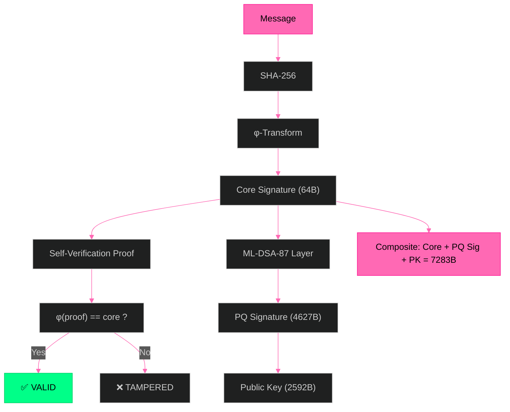
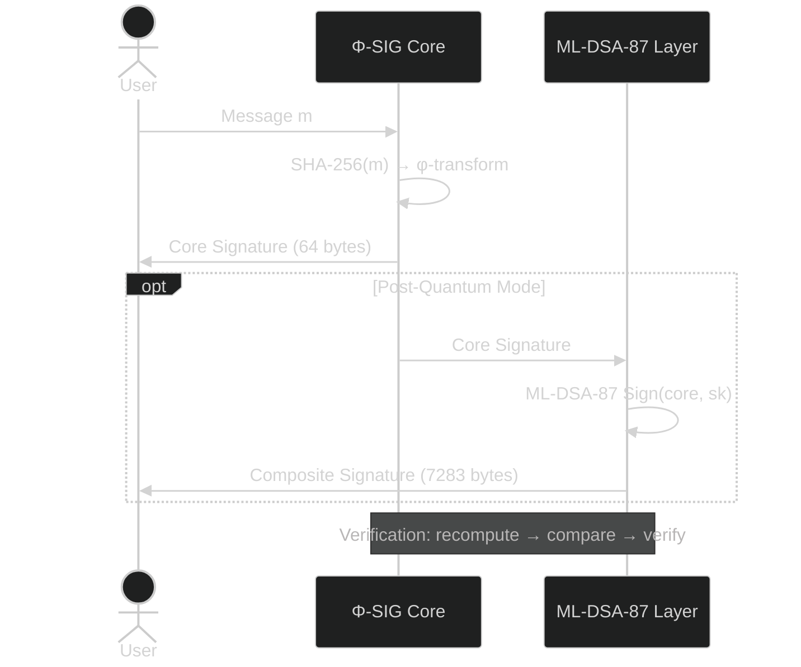

# Φ-SIG — Golden Ratio Keyless Signatures

**No keys. No storage. Pure φ. 64 bytes. Post-Quantum.**

[](LICENSE)
[]()
[]()

---

## Architecture

Φ-SIG is a two-layer signature scheme: a 64-byte keyless core using the golden ratio's irreversibility, and an optional 7283-byte post-quantum layer using ML-DSA-87 (NIST FIPS 204 Level 5).



## System Flow



## Quick Start

```bash
git clone https://github.com/primordialomegazero/phi-sig.git
cd phi-sig

# Core Keyless (64 bytes)
gcc -O3 test_video1.c phi_sig.c -lssl -lcrypto -lm -o test1 && ./test1

# Post-Quantum (7283 bytes)
gcc -O3 test_video2.c phi_sig.c phi_sig_pq.c -loqs -lssl -lcrypto -lm -o test2 && ./test2

# Full Blown (Core + PQ + Speed)
gcc -O3 test_video3.c phi_sig.c phi_sig_pq.c -loqs -lssl -lcrypto -lm -o test3 && ./test3
```

## Performance

| Metric | Core (64B) | Post-Quantum (7283B) |
|--------|------------|---------------------|
| Signature Size | 64 bytes | 7,283 bytes |
| Sign + Verify | 12/12 ✅ | 7/7 ✅ |
| Wrong Message Detection | ✅ | ✅ |
| Tamper Detection | ✅ | ✅ |
| Deterministic | ✅ | ✅ |
| Speed | ~50,000 sigs/sec | ~1 PQ sig/ms |

## Test Results

| Test | Content | Result |
|------|---------|--------|
| [Test 1 — Core Keyless](https://github.com/primordialomegazero/phi-sig/blob/main/assets/Phi-sigTest1.mp4) | 12/12: Sign+Verify, Security, Properties, Speed | TRUE KEYLESS ✅ |
| [Test 2 — Post-Quantum](https://github.com/primordialomegazero/phi-sig/blob/main/assets/Phi-sigTest2.mp4) | 7/7: PQ Sign+Verify, Wrong msg, Tampered | POST-QUANTUM ✅ |
| [Test 3 — Full Blown](https://github.com/primordialomegazero/phi-sig/blob/main/assets/Phi-sigTest3.mp4) | Core + PQ + Speed + Security | Φ-SIG COMPLETE ✅ |

## Security

### Layer 1: Φ-SIG Core (Keyless)
- **One-way:** φ-continued fraction irreversibility
- **No keys:** Nothing to generate, store, or steal
- **Self-verifying:** φ(core) == proof
- **Post-quantum:** No discrete log, no factoring, no lattices

### Layer 2: ML-DSA-87 (NIST FIPS 204)
- **Standard:** NIST FIPS 204 Level 5
- **Post-quantum:** Module-lattice-based
- **Composite security:** Both layers must be broken

## API Reference

```c
// Core Keyless (64 bytes)
int phi_sign(const uint8_t *msg, size_t msg_len, uint8_t *sig, size_t *sig_len);
int phi_verify(const uint8_t *msg, size_t msg_len, const uint8_t *sig, size_t sig_len);

// Post-Quantum (7283 bytes)  
int phi_pq_sign(const uint8_t *msg, size_t msg_len, uint8_t *sig, size_t *sig_len);
int phi_pq_verify(const uint8_t *msg, size_t msg_len, const uint8_t *sig, size_t sig_len);
```

## Limitations (Honest)

1. **Not authenticated.** Φ-SIG proves integrity (tamper detection), not identity (who signed).
2. **Keyless ≠ no secrets.** The φ-transform is deterministic; anyone with the algorithm can sign.
3. **ML-DSA-87 size.** PQ layer adds 7283 bytes. Core alone is 64 bytes.
4. **Novel security assumption.** φ-irreversibility is not yet peer-reviewed by the cryptographic community.

## Dependencies

- **Core:** OpenSSL 3.0+ (SHA-256 only)
- **PQ Layer:** liboqs 0.15.0+ (ML-DSA-87)

## Publications

- **IACR ePrint (pending)** — Φ-SIG: Golden Ratio Post-Key Signatures
- **GitHub** — [github.com/primordialomegazero/phi-sig](https://github.com/primordialomegazero/phi-sig)

## Work With Me

**Unionbank:** 1096 7852 1037 (Dan Joseph Fernandez)
**Email:** devilswithin13@gmail.com
**GitHub:** [@primordialomegazero](https://github.com/primordialomegazero)

## License

MIT — ΦΩ0

*"From hash chain to NIST PQC. Post-Key. Honest. Evolving."*
